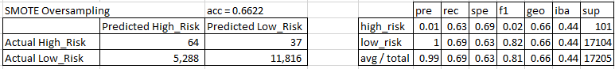
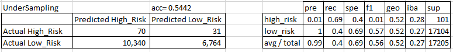
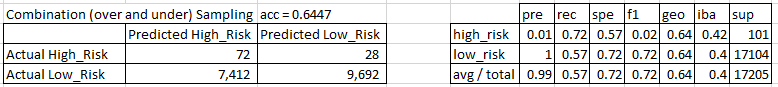
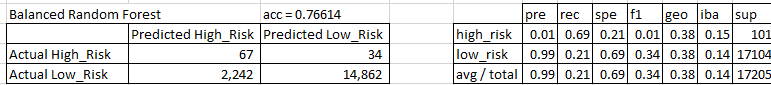
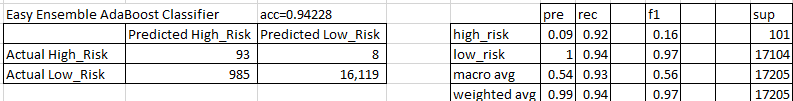

# Credit_Risk_Analysis

## Overview
Credit risk is an inherently unbalanced classification problem, as good loans easily outnumber risky loans. We have been challenged to employ several different techniques to train and evaluate models with unbalanced classes. We have been given a dataset from LendingClub, a peer-to-peer lending services company. Our challenge is to over and undersample the data to evaluate the performance of the models and make a written recommendation on whether they should be used to predict credit risk.  The nauture of this data set is very unbalanced with a small percentage being high-risk compared to the vast majority being low-risk. In order to compensate for this significant imbalance we will use 6 different imbalanced classifiers:

- Random Oversampling
- SMOTE Oversampling
- Undersampling
- Combination over and under sampling
- Balanced Random Forest
- Easy Ensemble AdaBoost Classifier

We will evaluate the performance of each of these techniques for this data set to see if any are notably better perofming and may be preferred. We will use accuracy, recall, precision, F1 score and confusion matrix to help us make this decision. It is possible that none of these techniques are significantly better than any others; if this is the case we will also explain why this result is acceptable. 

## Analysis Results
### Random Over Sampling

### SMOTE Oversampling

### Undersampling

### Combination Over and Under Sampling

### Balanced Random Forest

### Easy Ensemble AdaBoost Classifier

## Summary
Overall there is a challenge in precisely predicting high-risk loans without misclassifying a relatively large number of low-risk loans as high risk. However, given the very unbalanced nature of the data set this is not entirely surprising. 

For most of the models the recall and accuracy are mediocore at best. however, the AdaBoost classifier for this data performs relatively well. it still suffers from a low precision on identifying high-risk loans, but it has a very high accuracy (94%); and very good recall for high-risk loans. the f1 score is not great (0.16), but compared to the other models it stands out as being pretty good. 
If the goal is to minimize risk at the expense of missing out on rejecting some low-risk loans in mistaking them as high-risk then the AdaBoost classifier is definitely the best of the set tested here. 
